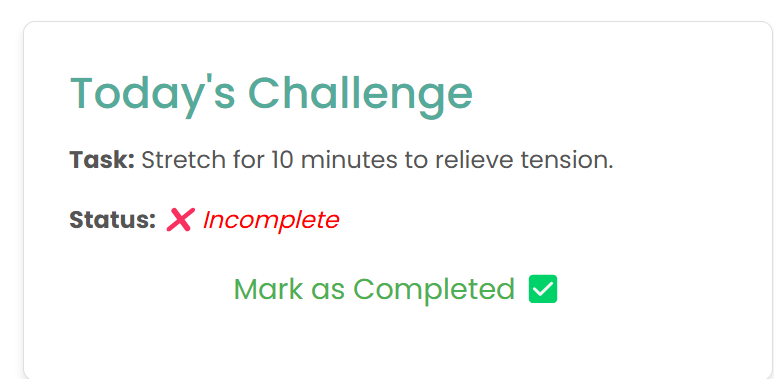
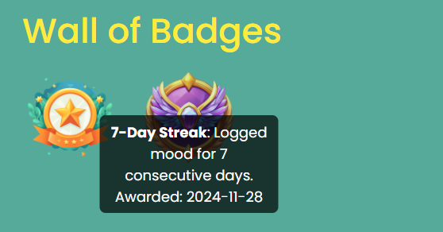
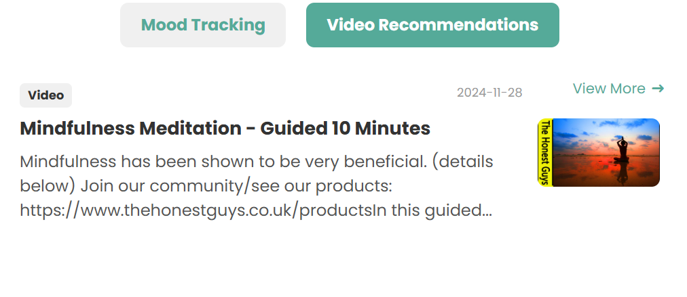
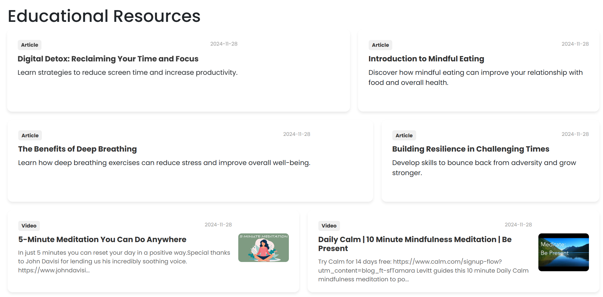
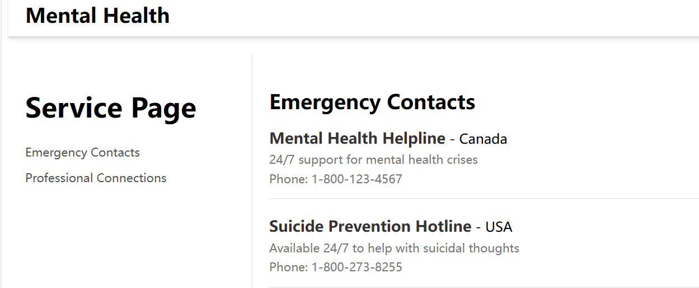
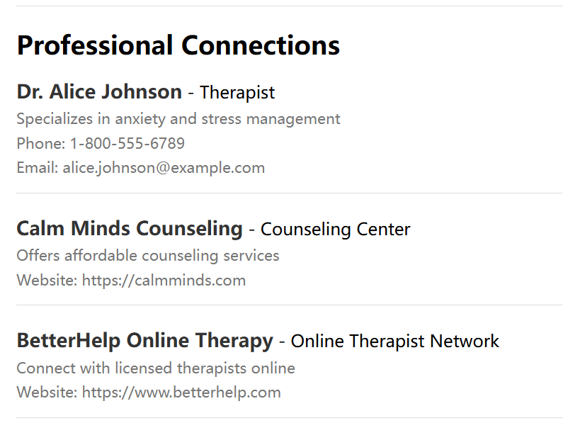
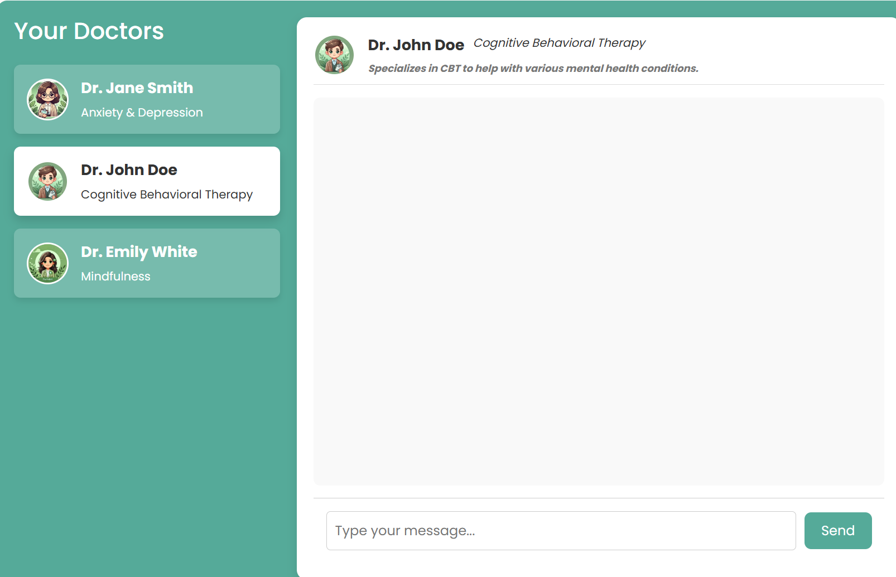

# **AI-Powered Mental Health Assistant**

An innovative AI-driven platform designed to provide users with tools for tracking mental health, engaging with gamification, and accessing personalized support resources. Our app integrates advanced AI features with an intuitive user interface to empower users to take control of their mental well-being. (Mohit could add some content)

---

## **Table of Contents**
1. [Key Features](#key-features)
2. [Technology Stack](#technology-stack)
3. [Project Setup](#project-setup)
4. [Core Components introduction](#core-components)
5. [user experience and user interface](#user-experience-and-user-interface)
5. [How It Works](#how-it-works)
6. [Testing](#testing)
8. [Future Enhancements](#future-enhancements)
9. [Contributors](#contributors)
10. [License](#license)

---

## **Features**

### **Core Features**
- **Mood Tracking**:
  - Log daily moods with a simple and intuitive interface.
  - Take a short note for every record help users recall
  - Track historical trends and visualize progress over time.

- **Daily Challenges**:
  - Automatically assigned challenges tailored to user preferences and needs.
  - Includes mindfulness exercises, gratitude journaling, and self-care tasks.

- **Gamification**:
  - Streak tracking encourages users to log consistently.
  - Badges awarded for achieving milestones, such as 3-day, 7-day, or 30-day streaks.

- **Support Services**:
  - Access to regional emergency contacts and professional connections.
  - Tab-based navigation for ease of use.

- **Recommendations**:
 - Provide users with a video or article resource about mental health on the dashboard page.
 - Provide a wide range of articles and video resources in the website's resource library for users to browse.
 
### **AI Integration**
- Personalized recommendations powered by OpenAI.
- Our website provides users with psychological health consultations through AI doctors, each specializing in different fields

---

## **Technology Stack**

| **Component**         | **Technology**        |
|------------------------|-----------------------|
| **Frontend**           | HTML, CSS, JavaScript |
| **Backend**            | Django               |
| **Database**           | SQLite               |
| **AI Integration**     | OpenAI API           |
| **Third-Party APIs**   | Emergency resource APIs |

---

## **Project Setup**

### **Prerequisites**
- Python 3.8+
- pip (Python package manager)

### **Installation Steps**
1. **Clone the Repository**:
   ```bash
   git clone https://github.com/{your-repo}/Mental_health.git
   cd Mental_health
   ```

2. **Create a Virtual Environment**:
   ```bash
   python -m venv venv
   source venv/bin/activate  # On Windows: venv\Scripts\activate
   ```

3. **Install Dependencies**:
   ```bash
   pip install -r requirements.txt
   ```

4. **Run Migrations**:
   ```bash
   python manage.py makemigrations
   python manage.py migrate
   ```

5. **Start the Development Server**:
   ```bash
   python manage.py runserver
   ```

6. **Access the Application**:
   Open [http://127.0.0.1:8000](http://127.0.0.1:8000) in your browser.

---

## **Core Components**

### **1. Mood Tracking**
- Allows users to log their emotions daily. The users could record their mood base on their situation at that day and they could take notes for the reason why they post those scores.


- Users could track their mood description record


- Users can track their emotional fluctuation curve through a line chart to understand their recent emotional stability.


### **2. Daily Challenges**
- Tasks tailored to user engagement (include journaling, meditation, and gratitude exercises).

  when users finish the tasks they can mark us complete and the task will update everyday to attract users.
### **3. Gamification**
- Awards badges for streak milestones to boost motivation.
- Tracks longest streaks and provides visual progress.

### **4. Recommendation**
- Randomly recommend an article or video from the content library on the dashboard page.

- Users can visit the recommendation page to view all videos and articles, allowing them to enrich their knowledge and learn how to maintain mental health.


### **5. Support Services**
- Provides users with:
  - Emergency contacts for mental health crises.
  - Professional connections, such as therapists and counselors. 



### **6. AI Integration**
- Use the OpenAI API to create three virtual doctors, each specializing in different fields, to provide users with more professional consultation services .


## **user experience and user interface**
1. **Notification**:
- A welcome notification for first-time registration is placed on the Notification page to enhance users' positive impression of the website.
2. **Emoji**:
Use emoji expressions to add fun when recording emotions.
3.**Dashboard Icon**
The icon in the dashboard welcome section changes based on the time of day. For example, if you log in during the morning, the icon will be a sun
## **How It Works**

1. **User Interaction**:
   - Users log in, track moods, and access daily challenges.

2. **AI-Powered Personalization**:
   - OpenAI generates challenges based on mood logs and trends.

3. **Gamification**:
   - Users earn badges and track streaks for consistent engagement.

4. **Support Services**:
   - Emergency and professional resources are dynamically fetched using third-party APIs.

---

## **Testing**

### **Run Tests**
To ensure all components are working as intended:
```bash
python manage.py test
```

### **Tested Features**
- User authentication
- Mood logging and streak tracking
- AI-generated challenges
- Badge awarding
- Support services (emergency contacts and professional connections)

---


---

## **Future Enhancements**

### **Planned Features**:
1. **Advanced Personalization**:
   - AI will adapt recommendations based on detailed user profiles.
2. **Community Features**:
   - Introduce group challenges and social forums.
3. **Multilingual Support**:
   - Make the app accessible in multiple languages.
4. **Therapist Integration**:
   - Connect users directly with licensed professionals for virtual therapy sessions.
5. **Enhanced Analytics**:
   - Provide insights into user engagement for mental health professionals.

---

## **Contributors**
- **GNG 5300 Group 5**
  - Mohit Upadhyay (**Your Name**: [https://github.com/Upadhyaymohit28/Mental_health](https://github.com/Upadhyaymohit28/Mental_health))
  - Zewei Wang (**Rocker**: [https://github.com/zewei-wang/Mental_health/tree/main](https://github.com/zewei-wang/Mental_health))
  - Xu Gao (**Wadeahh3**: [https://github.com/Wadeahh3/Mental_health](https://github.com/Wadeahh3/Mental_health))

---

## **License**
This project is licensed under the MIT License. See the LICENSE file for details.

---